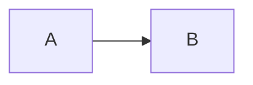

# Hugo Skills

## Content Structure

Blog articles use the [leaf bundle](https://gohugo.io/content-management/page-bundles/) pattern:

```
content/blog/YYYY/MM/<article-folder-name>/
├── index.md               ← article content + front matter
├── featured-<name>.webp   ← featured image (filename must contain "feature")
├── img/
│   └── screenshot.webp
└── asciinema/
    └── demo.cast
```

For multi-page entries (workshops, etc.), use a [branch bundle](https://gohugo.io/content-management/page-bundles/#comparison) instead.

## Featured Image

Priority order (highest to lowest):

1. **File in the article folder** whose name contains `feature` (e.g., `featured-diagram.webp`) — placed at the same level as `index.md`
2. **`featureimage`** front matter parameter — assign a URL: `featureimage: "https://…"`
3. **`featureAsset`** front matter parameter — path to a generic image: `featureAsset: "img/featured/image.webp"`

## Images

**All raster images must be in WebP format.** PNG and JPEG are blocked by CI and will cause the build to fail. Never add `.png`, `.jpg`, or `.jpeg` files to the repository.

Convert images before committing:

```sh
cwebp -q 60 image.jpg -o image.webp
# or
convert image.jpg -quality 60 image.webp
```

Quality `60` is recommended; use `80` for higher fidelity.

By default, Blowfish processes images for different resolutions, which can add a grey background to transparent images. To disable processing, add `default="true"` to the `figure` shortcode.

## Shortcodes

### Custom shortcodes (this repository)

| Shortcode | Parameters | Use |
|---|---|---|
| `` | `key` (required) — cast filename without `.cast`; optional: `cols`, `rows`, `autoPlay`, `loop`, `speed`, `theme`, `poster` | Embed an Asciinema terminal recording from `asciinema/<key>.cast` in the article bundle |
| `` | `repo` (required); `showThumbnail` (default `true`) | Render a GitHub repository card with metadata fetched from the GitHub API |
| `` | `src` (required) — filename without extension, matched against page bundle resources | Embed a self-hosted video using the HTML `<video>` element |
| `` | `link`, `title` (required); optional: `summary`, `featureimage`, `source`, `compact` | Render an article-card-style link to an external page |
| `` | positional: BiliBili BV ID | Appends a small "also available on BiliBili" note below a YouTube embed |
| `` + `{}` | `groupId` links same-ID tab groups across a page | Tabbed content blocks — any markdown is valid inside a tab |

### Blowfish theme shortcodes

| Shortcode | Use |
|---|---|
| `` | Image with caption; add `default="true"` to skip Blowfish image processing |
| `` | Callout / notice box |
| `` | Embed a YouTube video |

Full list: [Blowfish shortcodes docs](https://blowfish.page/docs/shortcodes/)

### Hugo built-in shortcodes

Hugo provides built-in shortcodes (`gist`, `ref`, `relref`, etc.). See [Hugo embedded shortcodes](https://gohugo.io/content-management/shortcodes/#embedded).

### Mermaid diagrams

Use a fenced code block tagged `mermaid`:

````markdown

````
